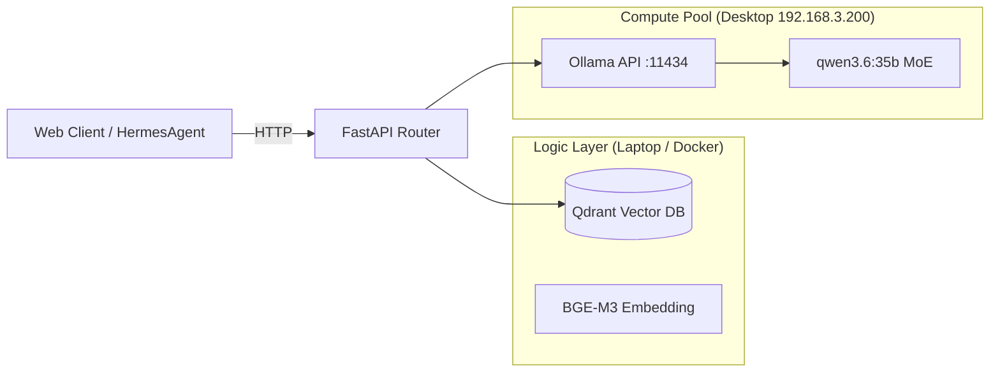

# Personal RAG Platform

**企业级私有化 RAG 知识库平台** — 存算分离架构，笔记本 Qdrant + 台式机 Ollama MoE 推理。

[](https://python.org)
[](https://fastapi.tiangolo.com)
[](LICENSE)

---

## 🏗 架构拓扑



| 节点 | 角色 | 核心组件 |
|------|------|----------|
| **笔记本** | 逻辑控制层 | Qdrant向量库 · BGE-M3 Embedding · FastAPI路由 |
| **台式机** (192.168.3.200) | 算力推演层 | Ollama · qwen3.6:35b-a3b-q4_K_M (MoE) |

---

## 📂 工程目录

```
personal_rag_platform/
├── docs/                   # 运维文档 (架构设计 · 部署指南 · 排查手册)
│   ├── 0_架构设计.md
│   ├── 1_环境部署.md
│   └── 2_问题排查.md
├── configs/                # Docker Compose 编排配置
├── src/                    # Python 源码
│   ├── main.py             # FastAPI 启动入口
│   ├── config.py           # Pydantic-settings 配置管理
│   ├── models.py           # Pydantic DTO
│   ├── rag_chain.py        # LangChain RAG Pipeline
│   └── utils/              # 工具模块
├── data/                   # Qdrant 持久化目录
├── pyproject.toml          # 包管理配置
├── .env.example            # 环境变量模板
└── README.md
```

---

## 🚀 快速启动

```bash
# 1. 克隆 & 配置环境
cp .env.example .env         # 修改 INFERENCE_HOST=192.168.3.200

# 2. 启动基础设施
docker compose -f configs/docker-compose.yaml up -d

# 3. 安装依赖 & 启动服务
uv pip install -e .
uv run python src/main.py
```

访问 `http://localhost:8000/docs` 查看 Swagger API 文档。

---

## 🔧 技术栈

| 组件 | 选型 | 说明 |
|------|------|------|
| Web 框架 | FastAPI 0.115+ | 异步 REST API |
| RAG 引擎 | LangChain 0.3+ | 文档切分 · 检索链路 · Prompt 管理 |
| 向量数据库 | Qdrant 1.12+ | Docker 部署，持久化挂载 |
| Embedding | BGE-M3 | 中英双语优化，1024维向量 |
| 大模型推理 | Ollama + qwen3.6 MoE | 台式机远程算力池 |

---

## 👤 作者

**Okze (张钰泽)** — AI MLOps 转型中，从 OA 运维到 LLM 应用落地。

📧 3239685@qq.com | 🐙 [GitHub: okze-521](https://github.com/okze-521)
