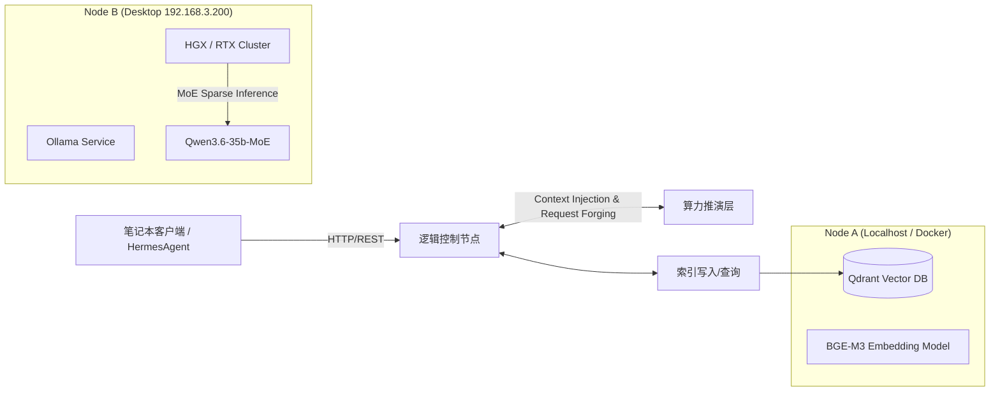

# 系统架构设计 (Architecture Design)

**章节目标**: 明确笔记本（逻辑控制层）与台式机（算力推演层）的分担角色。

## 1. 核心拓扑
本方案采用 **“存算分离” (Storage-Compute Decoupled)** 的分布式边缘计算架构。在有限的硬件资源下实现企业级 RAG 落地：
*   **节点一 (Logic Layer - 笔记本)**: 负责任何数据持久化、文档切片、Docker 容器管理及 API 接口分发（跑 Qdrant + BGE-M3）。
*   **节点二 (Compute Pool - 台式机 192.168.3.200)**: 承载高消耗的大参数模型推理任务（提供 GPU/Qwen-MoE 算力池）。

## 2. 技术栈清单

| 模块 | 承载节点 | 组件选型 | 核心规格说明 |
|------|----------|---------|--------------|
| **向量数据库** | 笔记本 | `qdrant/qdrant` (Docker) | 提供高效余弦相似度计算，索引文件挂载于本地 `/data`。 |
| **Embedding 引擎** | 笔记本 | `BGE-M3` (via Ollama) | 针对中英双语长文本优化，用于高质量向量化切片。 |
| **核心生成模型** |台式机 (192.168.3.200) | `qwen3.6:35b-a3b-q4_K_M` | **MoE **(混合专家)，通过稀疏激活技术降低显存，实现高吞吐响应。 |
| **应用编排层** | 笔记本 | `HermesAgent + Python` | 调度路由、Docker网络管理、跨机器代理转发。 |

## 3. RAG 数据流转闭环 (Core Workflow)

1.  **入库 (Ingestion)**: 笔记本端运行 `rag_demo.py` -> 读取原始 PDF/Markdown -> 调用本机 Ollama (BGE-M3) 产出向量 -> 写入 Qdrant。
2.  **检索与增强 (Retrieval & Augmentation)**: 用户 Query -> 笔记本进行 Top-K MMR 检索 -> 提取 Context 片段。
3.  **算力调度**: 拼接 Prompt 发送至台式机 `http://192.168.3.200:11434` -> Qwen-MoE 完成最终生成长文输出。

## 4. 运维规范与避坑点 (Ops Guide)

*   **MoE 热启动保护**: MoE 模型参数量大，跨网段请求易触发 `Timeout Exceeded`。必须在调用前执行 `ollama ls` 确认模型已预热完毕。
*   **跨机网络连通性**: 笔记本端通过 `curl http://192.168.3.200:11434/api/tags` 验证算力池存活。若不通，需检查台式机防火墙入站策略或 `OLLAMA_HOST` 环境变量。
*   **显存降级/抢占处理**: 当台式机同时运行 ComfyUI 任务时，必须在 Ollama 端增加 `OLLAMA_NUM_GPU=0` 限制或使用 `taskkill` 释放算力。
